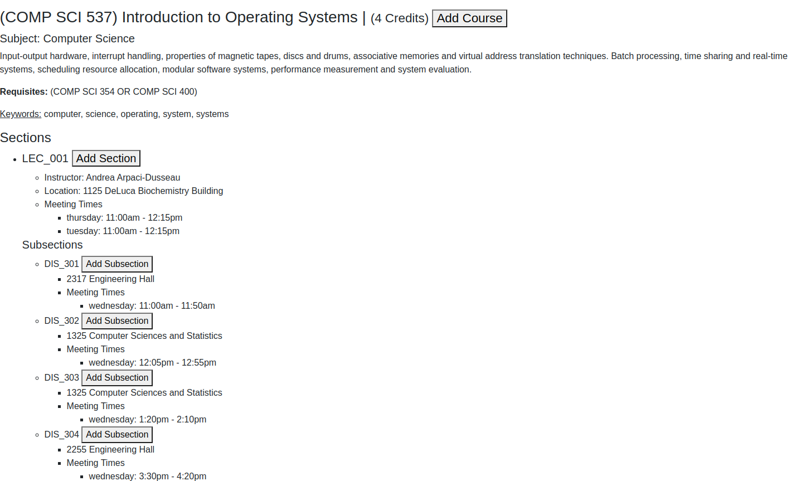

# Assignment: React 1 α (5 Points Total)

This assignment is meant to introduce you to more features of JavaScript, along with showing how a React project works. Additionally, this will introduce you to the different features of React, e.g. states, props, more modularized components etc. This project will be the first of a two part React project in which you will further extend your course management application. This application uses a limited quantity of modified data from the UW Madison course information database.

## Course Data

The course data is being fetched from `http://mysqlcs639.cs.wisc.edu:53706/api/react/classes` and is formatted as follows:

```
[
    {
        "credits": <number of credits for the course>,
        "description": <course description>,
        "keywords": <1D list of string keywords>,
        "name": <course name>,
        "number": <unique course number>,
        "requisites": <2D list of course requisites>,
        "sections": [
            {
                "instructor": <instructor name>,
                "location": <section location>,
                "subsections": [
                    {
                        "location": <subsection location>,
                       	"time": {
                            <weekday>: <time range>, ...
                        },
    			"number": <subsection number>
                    }
                ],
                "time": {
                <weekday>: <time range>, ...
                },
		"number": <section number>
            }, ...
        ],
        "subject": <course subject>
    }, ...
]
```

- The list of course requisites consists of 1D lists with AND operations between them. Each 1D list has OR operations between elements. For example: `[[A, B], [C, D, E], [F]]` means that the requisites are `(A OR B) AND (C OR D OR E) AND (F)`.
- A course can have any number of sections, and each section can have any number of subsections. If the course contains subsections, the user must schedule exactly one subsection with its parent section.
- Sections and subsections can have any number of times. Each time's key is a weekday in all lowercase ("monday", "tuesday", "wednesday", ...). Each time's value is a string with the following format: `"<12 hour time><am or pm> - <12 hour time><am or pm>"`. An example of this would be `"11:45am - 12:35pm"`.
- Each course has exactly one subject


Your project must be able to accept any data with the same format as above and the data located at `http://mysqlcs639.cs.wisc.edu:53706/api/react/classes`

## Problem 1 (1 point)

Required: `src/Course.js`<br>
Recommended: `src/Section.js` `src/Subsection.js`

For this problem, you will be creating and organizing a way to represent the course data to the user.

There is an empty div currently being displayed for each course. You will display ALL information associated with each course instead of this empty div.

You will be graded on successfully displaying ALL content for each course. Note that you can use a modal (popup) or accordion (collapsible) view, as long as there is a way to access all of the specified data about a given course from its component.
- **(0.1 points)** Name
- **(0.1 points)** Credits
- **(0.1 points)** Course Number
- **(0.1 points)** Course Description
- **(0.1 points)** Requisites
  - *Note: Must be displayed as described above e.g. `(A OR B) AND (C OR D OR E) AND (F)` for relevant courses, for no requisites display `None`.*
- **(0.1 points)** Keywords
- **(0.05 points)** Subject
- **(0.05 points)** Section Number
- **(0.05 points)** Section Instructor
- **(0.05 points)** Section Location
- **(0.05 points)** Section Meeting Times (Weekdays + Times)
- **(0.05 points)** Subsection Number
- **(0.05 points)** Subsection Location
- **(0.05 points)** Subsection Meeting Times (Weekdays + Times)

### Example Course Display


## Problem 2 (1.5 points)

Required: `src/SearchAndFilter.js`

For this problem, you will be designing a search and filter method to decide which courses to display given a variety of inputs:

- **(0.5 points) Credits**: only display courses that have an amount of credits within the selected credit range
- **(0.5 points) Subject**: only display courses that match the selected subject
- **(0.5 points) Search**: only display courses that have a keyword that contains (or is) the user input from the search bar.

Providing multiple fields (e.g. both credits and subject) will return the intersection of the sets.

## Problem 3 (2.5 points)

Recommended: Modifications to `App.js` `CourseArea.js` `Course.js` `Section.js` `Subsection.js` and/or additional Component(s)

For this problem, you will be creating a cart that users can **add** courses to and **remove** courses from.

### Add to cart (1 point)

The user should be able to add 3 slight variations of course information into the cart:
1. A course with **all sections and subsections**
2. A course with **one specific section** of a course with **all subsections**
3. A course with **one specific section** that contains **one specific subsection**.

For example, if course `CS 639` has section `Section 1` with subsections `Subsection 1` and `Subsection 2`, the user should be able to add either of the following with the format of: course -> sections -> subsections with one action (such as a button click)
1. `CS 639` -> `All` -> `All`
2. `CS 639` -> `Section 1` -> `All`
3. `CS 639` -> `Section 1` -> `Subsection 1`

### Remove from cart (1 point)

The user should be able to remove 3 slight variations of course information from the cart:
1. A course with **all sections and subsections**
2. A course with **one specific section** of a course with **all subsections**
3. A course with **one specific section** that contains **one specific subsection**.

For example, if course `CS 639` has section `Section 1` with subsections `Subsection 1` and `Subsection 2`, the user should be able to remove either of the following with the format of: course -> sections -> subsections with one action (such as a button click)
1. `CS 639` -> `All` -> `All`
2. `CS 639` -> `Section 1` -> `All`
3. `CS 639` -> `Section 1` -> `Subsection 1`

### View courses in cart (0.5 points)

The user should be able to view which courses are in the cart. From the cart, users should be able to remove courses as described above. For a course that only has some sections and/or subsections added to the cart, you can choose to display only these sections/subsections, or the data for the entire course while making it clear which sections/subsections the user has and has not added to the cart. When a course has been removed from the course, it should disapear immediately from the cart without any additional action from the user. 

---

**Run `npm install` in the terminal after cloning to automatically install needed npm packages**

This project was bootstrapped with [Create React App](https://github.com/facebook/create-react-app).

## Available Scripts

In the project directory, you can run:

### `npm start`

Runs the app in the development mode.<br>
Open [http://localhost:3000](http://localhost:3000) to view it in the browser.

The page will reload if you make edits.<br>
You will also see any lint errors in the console.

## Potentially Helpful Links
 - [Getting an Object's values](https://developer.mozilla.org/en-US/docs/Web/JavaScript/Reference/Global_Objects/Object/values)
 - [Getting an Object's keys](https://developer.mozilla.org/en-US/docs/Web/JavaScript/Reference/Global_Objects/Object/keys)
 - [An Array's forEach() method](https://developer.mozilla.org/en-US/docs/Web/JavaScript/Reference/Global_Objects/Array/forEach)
 - [forEach() with Arrays of Objects](https://stackoverflow.com/questions/16626735/how-to-loop-through-an-array-containing-objects-and-access-their-properties)
 - [Pushing elements onto an Array](https://developer.mozilla.org/en-US/docs/Web/JavaScript/Reference/Global_Objects/Array/push)
 - [Joining Array elements into a String](https://developer.mozilla.org/en-US/docs/Web/JavaScript/Reference/Global_Objects/Array/join)
 - [String to Int (parseInt())](https://developer.mozilla.org/en-US/docs/Web/JavaScript/Reference/Global_Objects/parseInt)
 - [React Bootstrap Modal View](https://react-bootstrap.github.io/components/modal/)
 - [React Bootstrap Accordion view ](https://react-bootstrap.github.io/components/accordion/)
